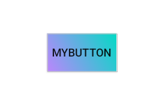

# My Widgets

## Dependency
1. kotlin version: 1.7.0
2. android compileSdk version: 31
3. androidx appcompat version: 1.4.2

## Usage
### add maven, jitpack (setting.gradle or project/build.gradle)
ex) setting.gradle
```groovy
dependencyResolutionManagement {
    ...
    repositories {
        ...
        maven { url 'https://jitpack.io' }  //add
    }
}
```
### add maven, jitpack (setting.gradle or project/build.gradle)
ex) setting.gradle
```groovy
dependencies {
    ...
    
    implementation 'com.github.hoonsa-lim:Android-My-Widgets:{latest release version}' //widget
}
```
### MyButton
```xml
<com.hoonsa.my_widget.MyButton
    ...
    app:gradientOrientation="topRight_bottomLeft"
    app:gradientColorStart="@color/purple_200"
    app:gradientColorEnd="@color/teal_200"
    app:cornerRadius="20dp"
    app:borderColor="#FF808080"
    app:borderWidth="1dp"
    ...
/>
```


